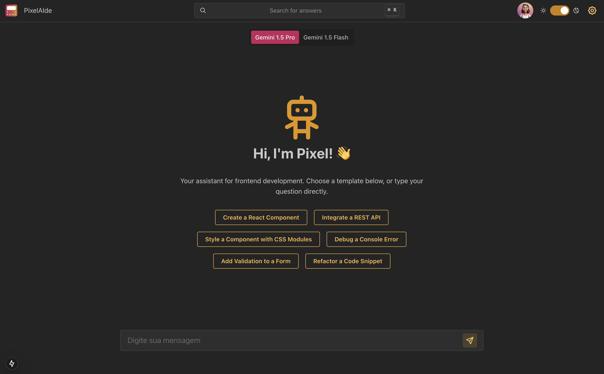
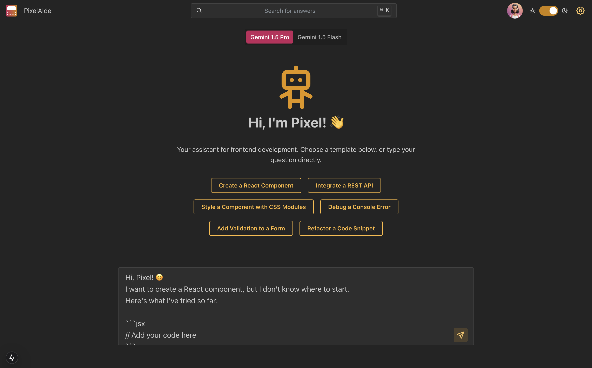
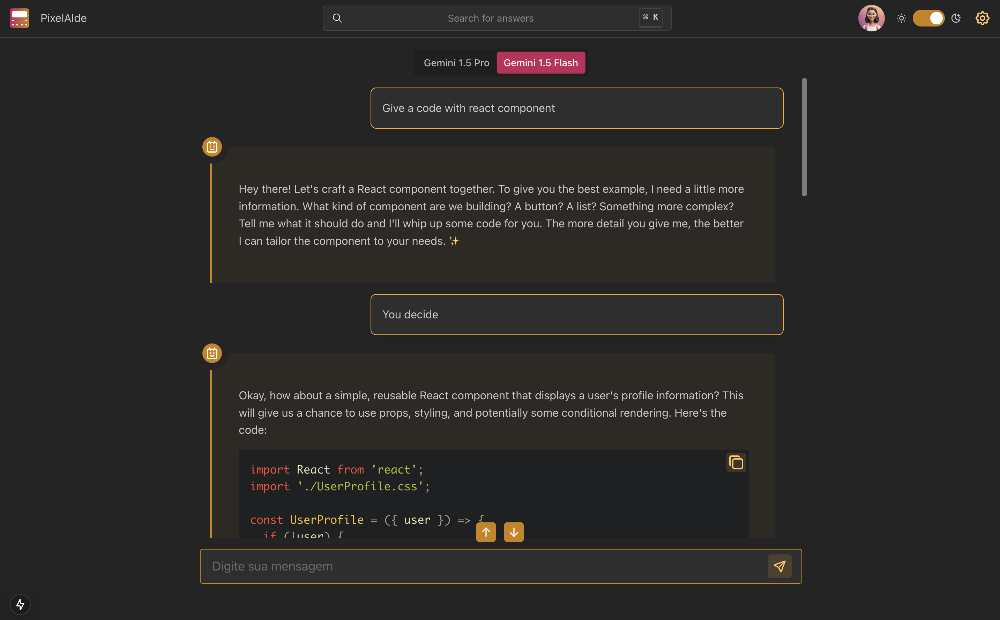
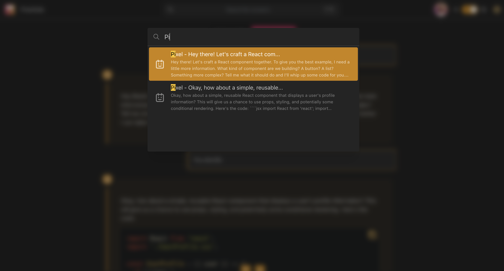
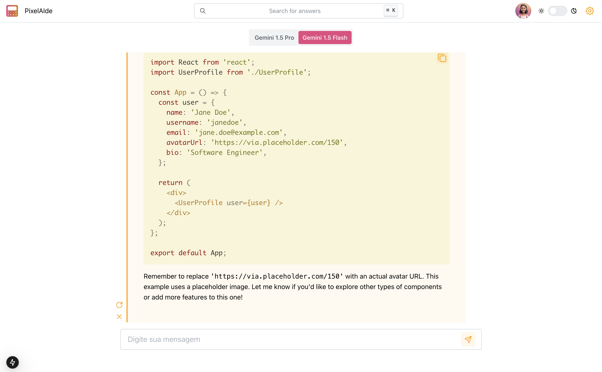
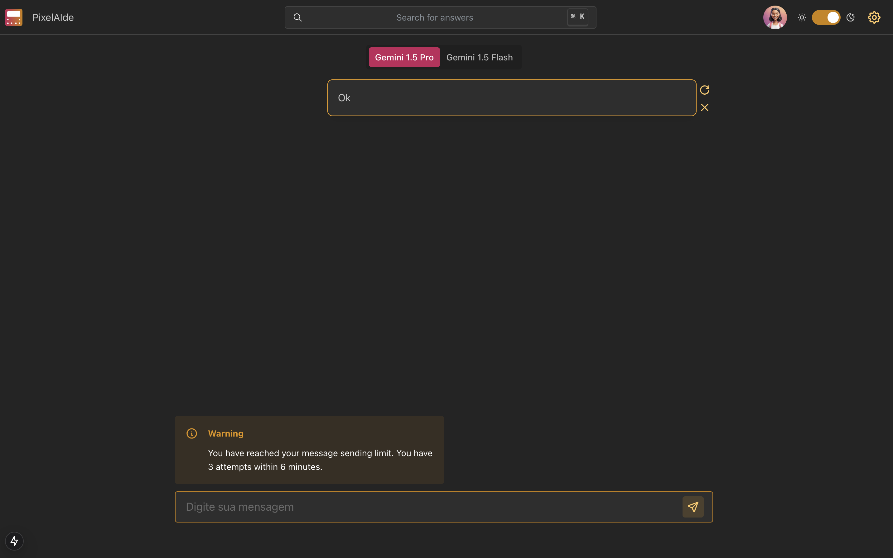

# PixelAIde - The assistant for frontend developers

## Welcome to the PixelAIde project repository

Hey, Dev! Have you ever imagined an assistant based on an **AI model totally focused on helping you in your daily activities as a frontend developer**? An assistant that brings more agility, quality and totally focused on helping you create incredible screens with organized, clean code without comments? And even more, that allows you to contextualize your conversations based on the technologies you use the most. You don't need to imagine any more, because we already have an assistant like that. And that's **Pixel**!

<div align="center">
  
</div>

## Summary

- [The main tools](#the-main-tools)
- [Using the project locally](#using-the-project-locally)
- [Using the platform](#using-the-platform)
- [Link to the platform deployment](#link-to-the-platform-deploy)

## The main technologies

[React](https://reactjs.org/)<br>
[Next](https://nextjs.org/)<br>
[Vercel](https://vercel.com/)<br>
[AI SDK](https://sdk.vercel.ai/docs/introduction)<br>
[Mantine](https://mantine.dev/getting-started/)<br>
[Gemini API](https://ai.google.dev/gemini-api/docs)<br>

## Using the project locally

### Clone the repository

After each of the following steps, there will be an example of the command to be typed to do what is being requested, if you have difficulties and the example is not enough, do not hesitate to contact me at _eduardawiltiner@gmail.com_.

1. Open the terminal and create a directory in the location of your choice with the **mkdir** command:

```javascript
mkdir pixelaide
```

2. Enter the directory you just created and then clone the project:

```javascript
cd pixelaide
git clone https://github.com/dudawiltiner/pixelaide.git
```

### Installing the dependencies

3. Enter the directory created after cloning the repository.

```javascript
cd pixelaide
```

4. Install all the dependencies using the **npm** CLI.

```javascript
npm install
```

### Debugging the application

5. Open the development environment of your choice. If using VSC, type the command **code .** in the root of the cloned directory.

```javascript
code .
```

4. Create a file called _.env.local_ based on a file from _.env.example_ and fill the environment variable with your key.

5. Run the application with node.js, using the **npm** CLI.

```javascript
npm run dev
```

---

## Using the platform

After each of the following steps, there will be an example of how each page can be used, if you have difficulties and the example is not enough, do not hesitate to contact me at _eduardawiltiner@gmail.com_.

### Start a conversation

To start a conversation with Pixel you can select a template in the format you want that best suits the problem you want to solve.

<div align="center">
  
</div>

### Get help from Pixel

Pixel can help you with anything related to frontend development. If you have any questions, ask her about backend.

<div align="center">
  
</div>

### Find messages

Find messages by searching for them in the search bar and scroll to the message you want to find.

<div align="center">
  
</div>

### Configure the Pixel

Configure the Pixel with your preferences and apply a series of contexts so that your conversations are increasingly focused on finding the solution more quickly.

<div align="center">
  
</div>

### Change mode

If you prefer dark mode, you can select the mode you want to keep in the _header_ and if you prefer light mode, do the same thing.

<div align="center">
  
</div>

### Rate Limit

We implemented a rate limit by ip to avoid overloading the models with so many requests, for greater security and cost control. Find out more at this link: https://sdk.vercel.ai/docs/advanced/rate-limiting

<div align="center">
  
</div>

## Link to deploy the Platform:

Link: https://pixelaide.vercel.app/

NOTE: Remember that to access the platform you must have a registration in the database.
